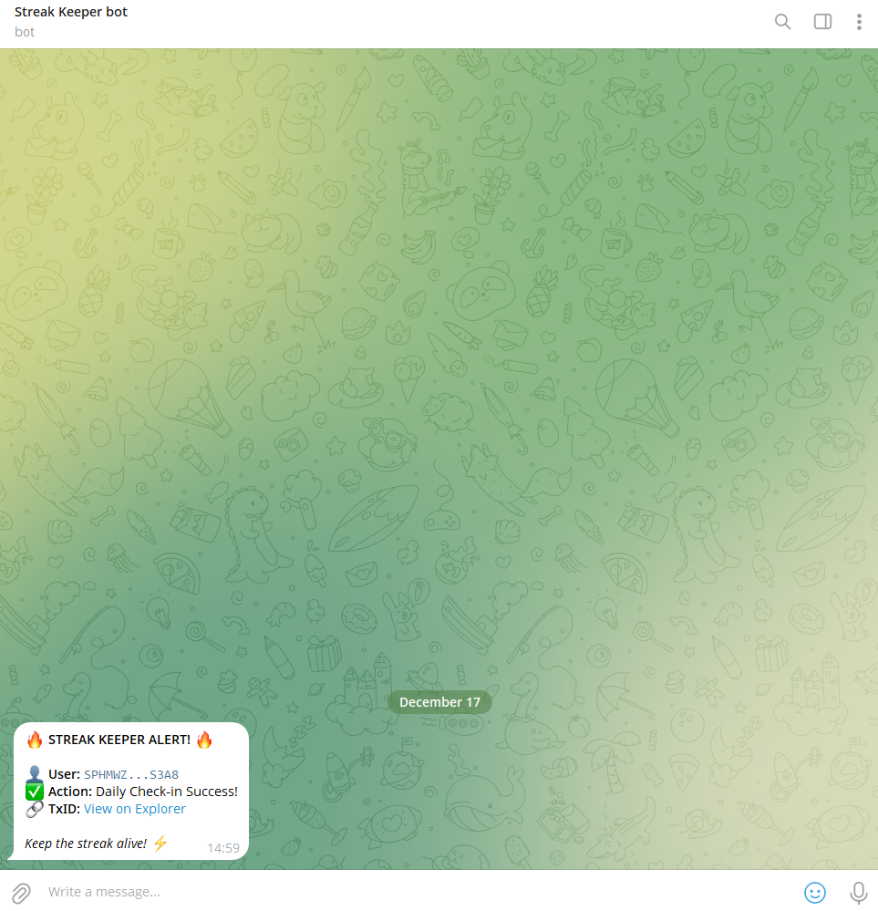

# Stacks Streak Keeper ⚡

> **Build your on-chain reputation through consistency.**

**StreakProtocol** is a decentralized habit-tracking application built on the Stacks blockchain. It allows users to "check-in" daily, recording their consistency immutably on Bitcoin layers, and mint SIP-009 NFTs to represent their achievements.


---

## 🏆 Stacks Builder Challenges Submission

This project is actively participating in the Stacks Builder Challenges. It demonstrates a complete dApp lifecycle including smart contract integration, wallet authentication, and transaction signing.

### Key Integration Highlights
*   **Smart Contract Deployment:** The core logic is deployed on Stacks Mainnet.
*   **@stacks/connect:** Used for seamless wallet authentication (Hiro Wallet, Xverse) and initiating transaction signing flows.
*   **@stacks/transactions:** Used for `callReadOnlyFunction` to fetch user stats and `openContractCall` for writing state to the blockchain.
*   **SIP-009 Standard:** Implements NFT minting functionality for streak milestones.

---

## ⛓️ Smart Contract Details

The application interacts with the `teeboo-streak` contract deployed on Stacks Mainnet.

| Network | Contract Name | Address |
| :--- | :--- | :--- |
| **Mainnet** | `teeboo-streak` | [`SPHMWZQ1KW03KHYPADC81Q6XXS284S7QCHRAS3A8`](https://explorer.hiro.so/txid/SPHMWZQ1KW03KHYPADC81Q6XXS284S7QCHRAS3A8.teeboo-streak?chain=mainnet) |

**Functions used:**
1.  `check-in`: Records a daily action, increments streak count, and updates the timestamp.
2.  `get-user`: Read-only function to fetch current streak, max streak, and total check-ins.
3.  `claim-streak-nft`: Mints a SIP-009 compliant NFT based on user progress.

---

## 🔔 Chainhook Integration

Integrated Hiro Chainhooks to push real-time notifications to Telegram community channel


---

## 🚀 Features

*   **Wallet Connection:** Secure authentication using Stacks native wallets.
*   **Daily Check-in:** execute an on-chain transaction to prove your activity for the day.
*   **Real-time Dashboard:** View your Current Streak, Max Streak, and Total Check-ins fetched directly from contract storage.
*   **NFT Minting:** Claim a "Streak Master" NFT badge when you reach milestones.
*   **Global Leaderboard:** Compare your consistency against other addresses in the ecosystem.

---

## 🛠 Tech Stack

*   **Frontend:** React, TypeScript, Vite
*   **Styling:** TailwindCSS
*   **Blockchain SDKs:**
    *   `@stacks/connect`: Auth & Transaction UI.
    *   `@stacks/network`: Network configuration (Mainnet).
    *   `@stacks/transactions`: Data formatting (CV) and API calls.

---

## 📦 Installation & Run

1.  **Clone the repository**
    ```bash
    git clone https://github.com/tieubochet/stacks-streak-keeper.git
    cd stacks-streak-keeper
    ```

2.  **Install dependencies**
    ```bash
    npm install
    ```

3.  **Run local development server**
    ```bash
    npm run dev
    ```

4.  **Build for production**
    ```bash
    npm run build
    ```

---

## 🤝 Contributing

Contributions are welcome! Please feel free to submit a Pull Request.

---

*Built with ❤️ for the Bitcoin & Stacks Ecosystem.*